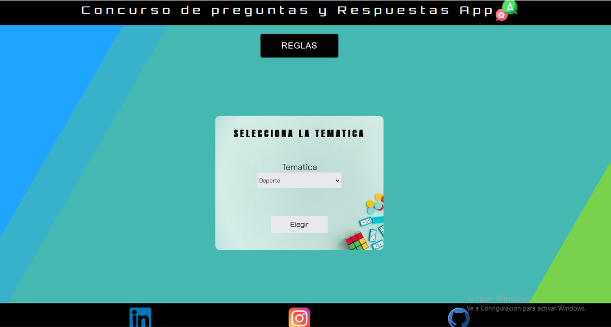
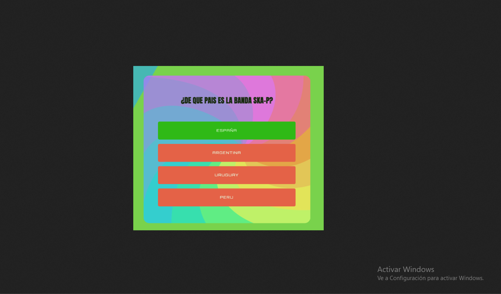

# Concurso de preguntas y Respuestas-APP
Concurso de preguntas y Respuestas-APP es una aplicación web que permite al jugador poner a prueba sus conocimientos en un desafío difícil que consiste en poner a prueba su criterio e inteligencia para resolver las preguntas en un tiempo determinado.

## Instrucciones
La aplicación consta de un cuestionario con 5 preguntas, entre las que el usuario puede elegir una asignatura libre. Cada pregunta tiene dos modos de juego, el modo "Selección múltiple" y el modo "Respuesta directa". Si el usuario decide responder usando el primer modo, ganará 2 puntos. Si elige el segundo, ganará 5 puntos. Si no logra acertar en cualquiera de los dos modos, obtendrá 0 puntos. El máximo es de 25 puntos.
                                                
Los temas para elegir son:

* Política.
* Deportes.
* Cultura general.
* Música.

El ranking de puntuaciones se mostrará al final.


### Instalación y puesta en marcha 🚀🔧
```
git clone
Open index.html
```

## Las herramientas que utilicé para crear este proyecto:
- [Swal] (https://sweetalert.js.org/guides/) - Modal personalizado utilizado.

## Autores ✒️
_Proyecto realizado por mí mismo._

* Elvis Serna - Author.
* Licencia 📄.
* Reservados todos los derechos.


## Capturas de pantalla




